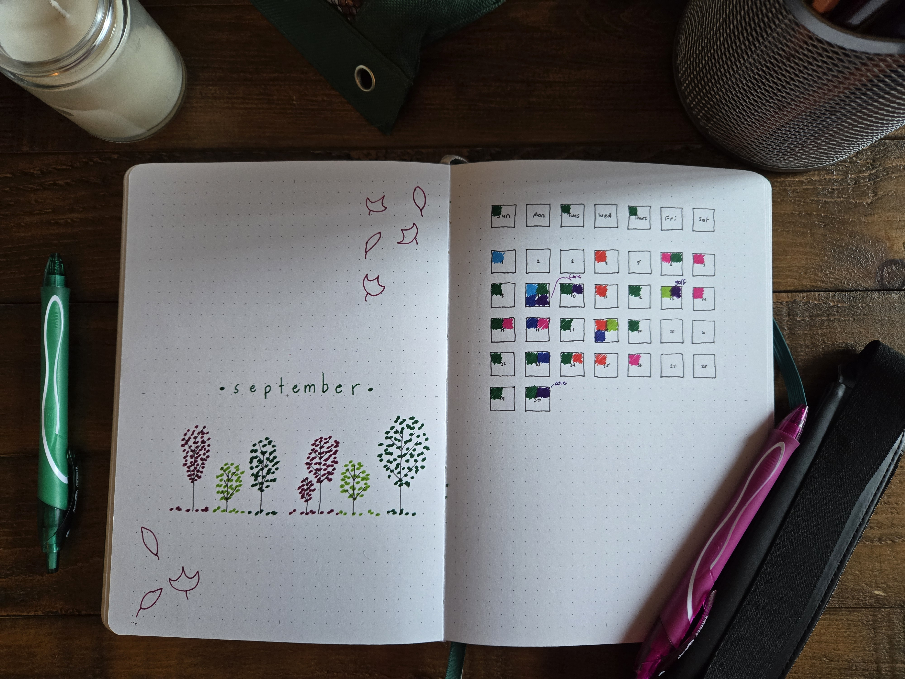
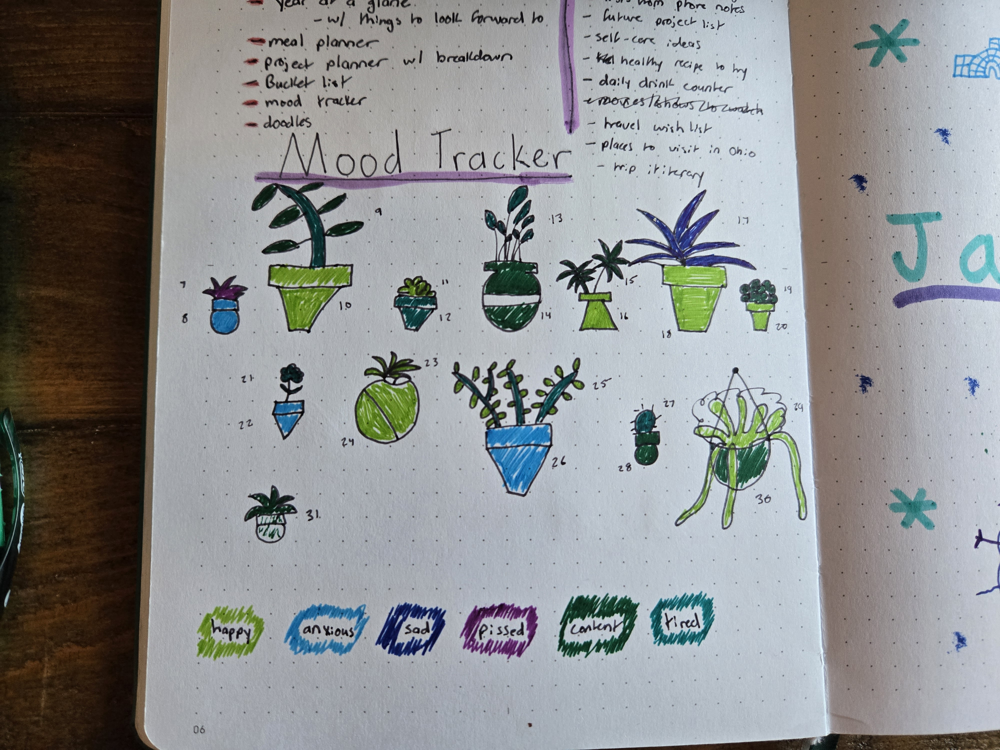
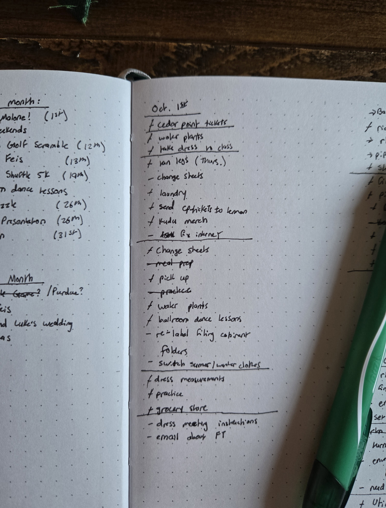
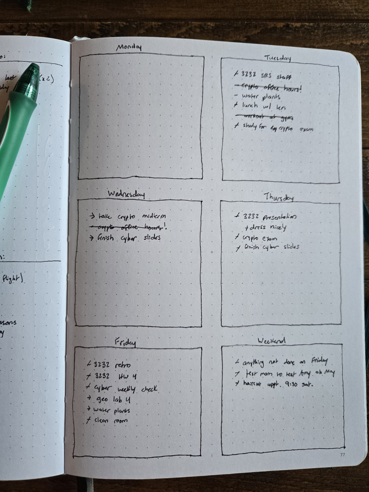
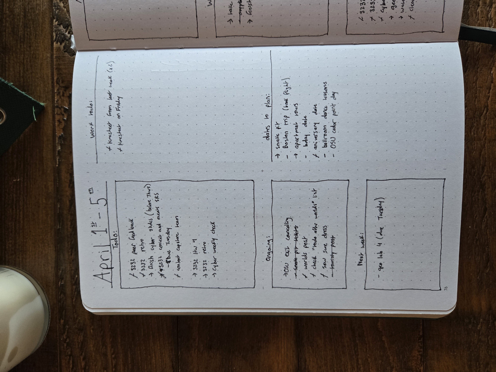

Trust me, I've been there. Looking up endless "Top 10" lists for bullet layouts because you just aren't satisfied with yours or you're looking to try out something new! Personally, I believe that a layout should be specific to what you want to organize. But sometimes we need to see some ideas and examples to inspire us. So here are my favorite layouts I've used so far. 

### Monthly: 
I love a monthly spread. It gets you excited for the upcoming season and refocuses your attention on your goals. A monthly spread can be a great time for reflection: 
- What worked for you in your journaling? What didn't work so well? 
- Which parts do you want to keep and which should you go without? 
- Is there anything new you want to try? 
- How would you like to improve? 

I love to have a themed monthly page to start out my monthly planning. It gives me a space to be creative with my journaling and sets up the loose theme for the rest of my ***fancy*** pages. (Note: Not all of my pages are fancy and done up for the blog. Most are purely functional and that's okay! More on this further in the blog.)

Next I'll put my trackers! I like to start off with one that looks like the monthly calendar that I can color in. It keeps me on track with teh days for the rest of my calendars. And if I miss a day of coloring in, I can look back in my calendar app and match up the days I missed and think about what I did that day. This first tracker is usually my exercise tracker. 

For the rest of the trackers, I like to make them themed and colorable like a coloring book! Doing it this way makes me excited to come back and color things in. It also motivates me to drink water, read, exercise, etc. because I'll want to come back and color in the picture I drew! But I can't cheat and color in without following through! 

The last thing I'll do for my monthly planning is what I like to call, an Overview Page. On this page, I'll list monthly todo items, events happening this month, events to prepare for in the next month and anything else specific to that month that I want to remember like goals, reminders etc. This way, I can look back when I plan my weeks and see if there is any todo items or reminders I need to add to that week.

### Weekly

My weekly layouts vary a lot based on what I have going on that week and the type of information I need to organize for myself. So, I'll list a few options. 

First I have my basic "I'm in a rush and just need to write a list this week" spread. This is where I won't worry about the way the page looks and make it purely functional. I like this for busy weeks where I still need to keep track of a lot of things but I don't have time to put in the effort to make it look pretty or draw boxes. Usually what I'll do is start a list and then when I get to the next day, I'll draw a line under the last item I got done in the list and basically move the list from the day before to the next day. 

Next, I have a layout that spreads todo items by day of the week. I like this for when I have a lot of due dates like for school or work. That way, I can plan to do items a few days in advance before they are due later in the week and really plan out the use of my time for the week. For example, if I know I have a paper due on Friday, I'll put writing the outline as a todo item on Monday and then writing the intro on Tuesday etc. 

### Daily

I don't always do daily spreads because during busy seasons I don't have a lot of time to make a new journaling page every day. But I do like them for a day where I have a lot of appointments or ones where I need to manage my time well to make due dates. Here's an example of my favorite daily spread that I've gone back to time after time. ***Old Reliable*** if you will. 

That's my list! I hope you get inspired for your own journaling journeys and employ the use of one of my spreads. These layouts have gotten me through very stressful times and I hope they can help you do the same! But at teh end of the day, your journal is exactly that: yours! Make it work for you! Journaling shouldn't be a chore and should actually help you get through your day! Bye for now! 