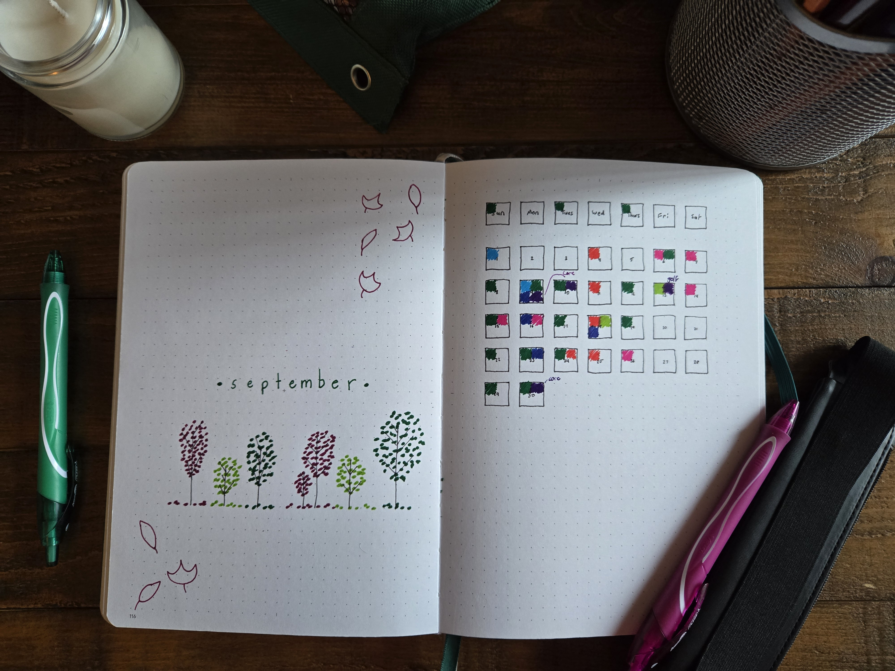

### Monthly Layout
I love starting with a monthly spread. It’s a great way to get excited for the upcoming season and refocus on your goals. A monthly spread can also be a perfect opportunity for reflection:

- What worked well in your journaling? What didn’t work?
- Which elements do you want to keep, and which ones should you ditch?
- Is there anything new you'd like to try?
- How would you like to improve?

I always like to start my monthly planning with a themed page. It’s a space to get creative and sets the tone for the rest of my "fancy" pages. (Note: Not all my pages are fancy or detailed like the ones on this blog. Most are purely functional, and that’s perfectly fine! I’ll dive into that later.)

Next, I add my trackers. I like to begin with one that resembles a monthly calendar, where I can color in the days. This helps me stay on track with the days for the rest of my calendars. If I miss a day, I can refer back to my calendar app to see what I did that day and catch up. I usually make my first tracker my exercise tracker.

For the rest of my trackers, I like to make them themed and colorable—like a coloring book! This approach excites me to come back and fill in the sections. It also motivates me to drink water, read, exercise, and more, because I’m eager to color in the pictures I drew! The best part is, I can’t cheat and color in the picture without actually completing the task!

The last part of my monthly planning is what I call my Overview Page. On this page, I list todo items for the month, events happening that month, events to prepare for in the upcoming month, and anything else I want to remember—such as goals and reminders. This way, when I plan my weekly spreads, I can check this page to see if there are any tasks or reminders I need to include for that week.

### Weekly

My weekly layouts change depending on what I have going on that week and what information I need to organize. Below are a few options that I rotate between:

First, my basic "I’m in a rush and just need a list" spread. This layout is purely functional—no worry about aesthetics, just getting things down. I use this for busy weeks when I need to track a lot but don’t have the time to make it look pretty. I’ll usually start a list and, when I move to the next day, I draw a line under the last completed task and move any leftover items to the next day.

Next, I use a layout where todo items are spread by the day of the week. This is perfect for weeks when I have multiple deadlines, like for school or work. I plan ahead, breaking tasks into manageable steps. For example, if I have a paper due on Friday, I might write “outline paper” as a task for Monday, and “write intro” for Tuesday, and so on.

### Daily

I don’t always use daily spreads, especially during busy times when I don't have the time to create a new journaling page every day. However, I do love using them when I have a lot of appointments or need to manage my time carefully for upcoming deadlines. Here's an example of my favorite daily spread—my ***Old Reliable*** that I always come back to.

That's it! I hope this post inspires your own journaling journey and helps you explore new layouts. These spreads have been incredibly helpful for me during stressful times, and I hope they can do the same for you. At the end of the day, though, your journal is yours! Make it work for you. Journaling should never feel like a chore—it’s a tool to help you stay organized and get through your day. Happy journaling!