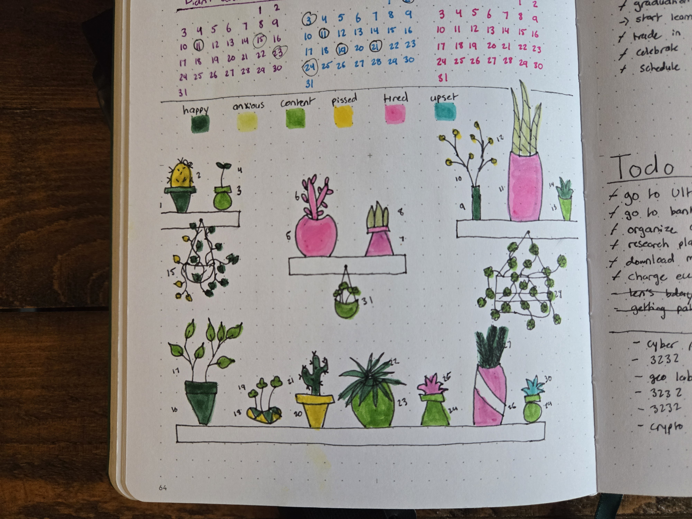

## Monthly Spreads
I have a few monthly spreads this year that turned out particularly well.

First, there’s April. I absolutely love how the butterflies turned out. I tried using a new medium—colored pencils—and I think the wings came out beautifully! I saw this idea online and thought I’d give it a try for myself.

Another month I really loved was May. This was one of the first times I tried drawing a mandala, and I was so pleased with how it turned out! Mandalas are such a fun and intricate design to create without needing much pre-planning. 

This is the very first mandala I ever drew, and I’m still proud of it! I wanted to fill the whole page with it, but in hindsight, I probably wouldn’t do that again. It’s difficult to keep the full circle symmetrical. I’ve found that half or quarter-circle mandalas are much quicker and easier to make, while still being forgiving.

## Plants

I absolutely love drawing plants! They always brighten up a page and are surprisingly simple to draw. Plus, I enjoy drawing the plants I actually have in my office—it’s like bringing real-life inspiration into my journal!

This first page is a full two-page plant doodle, complete with pots and shelves. It’s kind of how I imagine my future home looking! Later, I went back and added color to some of the plants, giving me a coloring book-style page to look forward to. I wanted a lot of variety, so I went all out with this one!

This is another page where I really went all out with plants. I had a list of self-care items that I wanted to turn into a special spread. I was searching for inspiration online when I came across this plant seam along the inner part of the page. I loved it and had to try it for myself.

I also love using plants in my habit trackers. This one is a mood tracker, where each part of the plant represents a day of the month. I added a key to show which emotion I felt on each day. The only downside to this tracker is that it’s a bit odd to color in a plant with a weird color to represent a negative mood, but it’s still fun to track. If you choose colors that look good together no matter where you place them, it might work out even better!

## Places to Try Lists

I moved to a new city this year, so I spent some time researching restaurants and bars I wanted to try. After compiling my list, I decided to create a fun page to showcase it. I’m especially proud of the bar scene I drew—yes, I went a little over the top with it! I also love the doodles I added to the restaurant list to give the page a little extra flair. This was around the time I had just gotten a new sticker book, so I used those stickers throughout the page too!

## New Years Goal Setting

With the new year fast approaching, it’s time to set new goals! For my goal-setting page, I kept the layout simple and clean to keep the focus on the most important part—the goals themselves. I also color-coded the goals to correspond with habit trackers I was setting up for the new year. This way, I can easily visualize which habits will help me achieve my goals.

That’s all I have for now! I hope these pages inspire you as you plan your own journal for the new year. Happy journaling!
