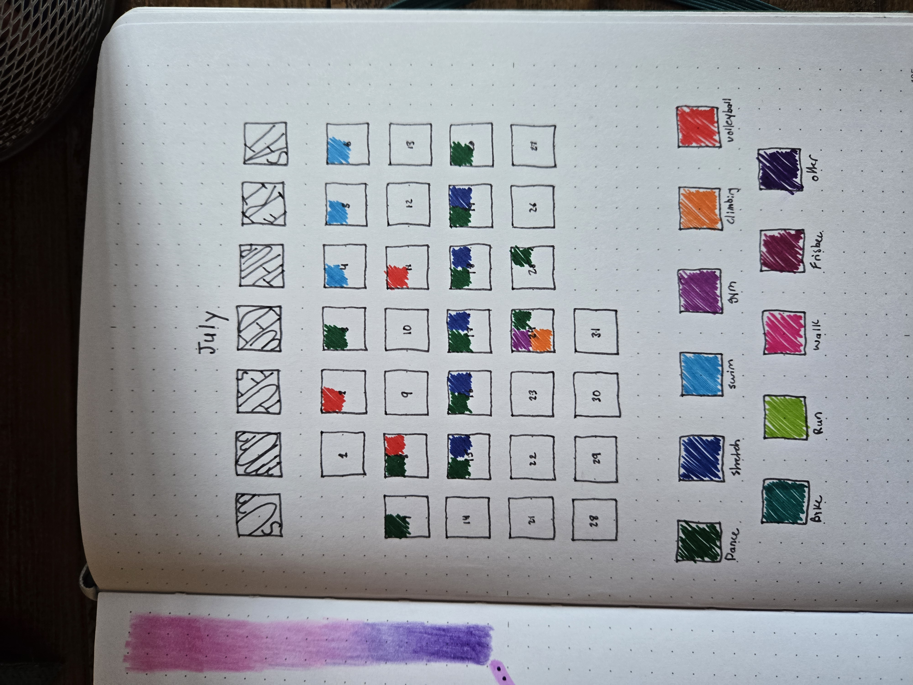

You can do this with any of your hobbies: knitting, reading, movie watching, are just some ideas that I have seen online. 

Since exercising is one of new years resolutions that I set up in my last blog post [Journal For 2025](https://blog-posts-dhm.pages.dev/posts/journal_for_2025/), I thought a dedicated journal would help me stay organized and motivated.

First, I want to make a plan and put it near the front of the journal. This page will act as my roadmap and I'll come back and reference it often. I am training for something in February so that will be my deadline and my roadmap will be set up on that timeline. This journal is lined and doesn't have the bullet journal dots so this will be a new experience for me. 

Next, I want to start off every month with am exercise tracker. I have a layout that I already like and it forces me to open this journal every day to track what I have been doing which I have found, keeps me engaged and accountable. 

I have a key at the bottom that corresponds a color with a different type of workout. Then I will color in the box for each day. That way, I can quickly glance at this page and get a general idea of my progress and if I have been sticking to my plan. 

Here is a completed one that I have featured in my post [Best Bullet Journal Layouts to get Things Done](https://blog-posts-dhm.pages.dev/posts/best_bullet_layouts/)

Now we can get into the daily pages of this journal. My idea is after my workout for that day, I can have a dedicated page to write down any important notes like:
- How did that workout feel?
- What weights and reps was I doing for these exercises? 
- What is something I discovered that may help me later? (ie. a form correction, a mindset change, etc.)
- Are there any changes to my routine that I want to make? 

And then I'll have a section on notes in case something cool happened like "I saw my gym friend there today", or it can be a space for gratitude and self-love like "I am proud of myself for sticking through that tough workout even though I wanted to quit". 

Here are a few sample layouts that I am playing around with. 

Last thing I want to include is a page for meal prep ideas. I have been trying to get in the habit of meal prepping on Sundays for the upcoming week. I find I get busy in the middle of the week and don't want to cook for myself so having meals already prepared has been really helpful. I like big one pot meals that I can use for dinner the night I make it and then have plenty of leftovers to put in the freezer for later. 

Here is the start of my meal prep ideas page: 

That's all for now! I hope this post has inspired you to keep a journal for your own hobbies! Happy Journalling in the new year! 